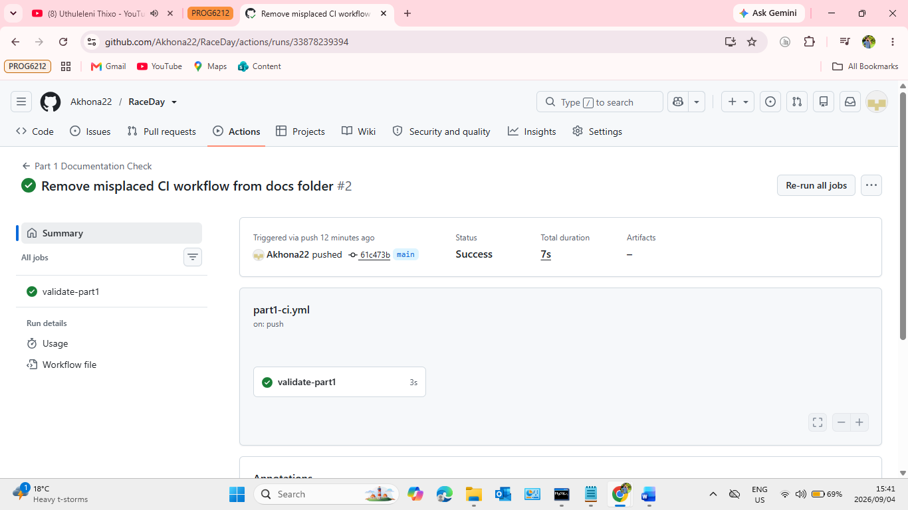

# RaceDay

RaceDay is an event management system designed to help organisers manage events, categories, participant enrolments and race results.

This repository contains the planning and database work for PROG6212 Programming 2B Part 1.

## User Roles

### Organiser
An Organiser can create, update and delete events, manage event categories, view participant enrolments, capture participant results and view the events they manage.

### Participant
A Participant can create an account, log in, browse available events, enter an event, select a category and view their own enrolments and results.
## Database Setup

The RaceDay database script is located in the `docs` folder as `RaceDay_Database.sql`.

The RaceDay Part 1 database script is written for Microsoft SQL Server and is intended to run on a clean SQL Server instance.

To set up the database:

1. Open SQL Server Management Studio.
2. Open the `RaceDay_Database.sql` file from the `docs` folder.
3. Run the script on a clean SQL Server instance.
4. The script creates the RaceDay database, tables, relationships and constraints.
5. The script inserts sample data for organisers, participants, events, categories, enrolments and results.
6. Run the included SELECT statements to verify the inserted data.

## CI/CD Status

GitHub Actions is configured to validate the required Part 1 repository files.

The workflow checks that the following files exist:

- `docs/RaceDay_ERD.pdf`
- `docs/RaceDay_API_Endpoint_Plan.pdf`
- `docs/RaceDay_Database.sql`
- `README.md`

The latest workflow run completed successfully.

   
